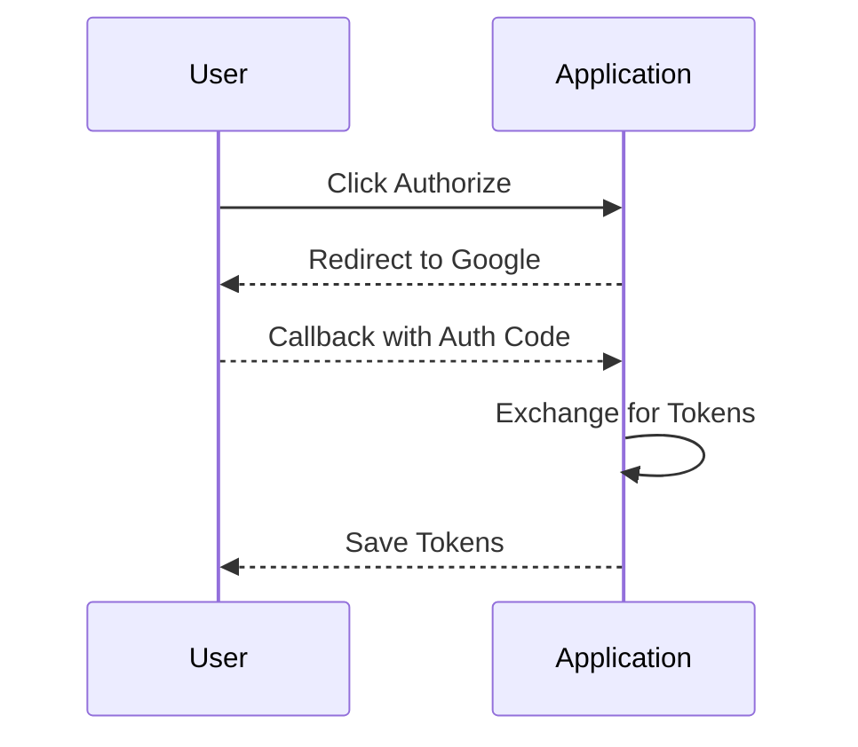

# Gmail Summary 📧

Gmail Summary is a Spring Boot application that allows summarizing, filtering, and querying Gmail mailbox. It uses the Gmail APIs to fetch user emails and provides a REST API to search through them.

## Features 🚀

- OAuth 2.0 authentication for Gmail API access 🔐
- Fetch list of emails from a Gmail account 📥
- Filter emails by date range and keywords 🔎
- Clean REST API to search emails ✨
- Reactive API with Flux return type ☁️
- Test cases included ⚙️

## Authentication Flow 🔐



1. User clicks authorize button to initiate OAuth flow
2. User is redirected to Google for authentication
3. Authorization code is extracted from callback URL
4. Tokens are retrieved and stored for future API access

## Dependencies 📦

- Spring Webflux
- Spring Security
- Google OAuth Client
- Gmail API Client

## Getting Started 🚀

```
git clone https://github.com/mgorav/gmail-summary.git
cd gmail-summary

# Add google credentials file  

./mvnw spring-boot:run
```  

## Configuration ⚙️

Update `application.properties` file with your credentials

```properties
google.client-id= #Client ID  
google.client-secret= #Client Secret
google.redirect-uri=http://localhost:8080/oauth2callback  
```

## REST API 📡

```  
GET /emails?userId=&keywords=   
```

Returns list of emails as JSON

## Testing ✅

Run unit and integration tests

```
./mvnw test
```

## Work In Progress 🚧

### Email Summarization

Planned integration with conversation AI models like OpenAI to generate email summaries:

- User will be able to get key highlights from emails
- Will provide short summaries from long email threads
- Natural language instructions to produce the summary
    - "Summarize the key points from this email thread"
    - "Provide 5 bullet point summary with important details"

This will enhance the email search and discovery capabilities through generated summaries.
